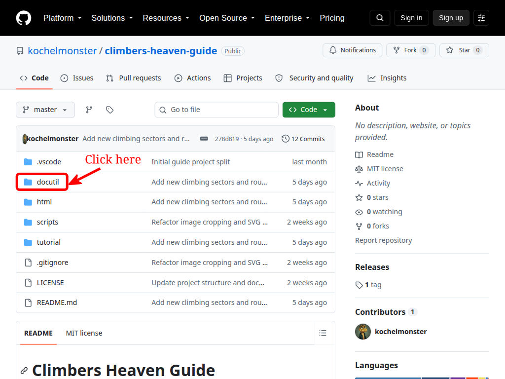
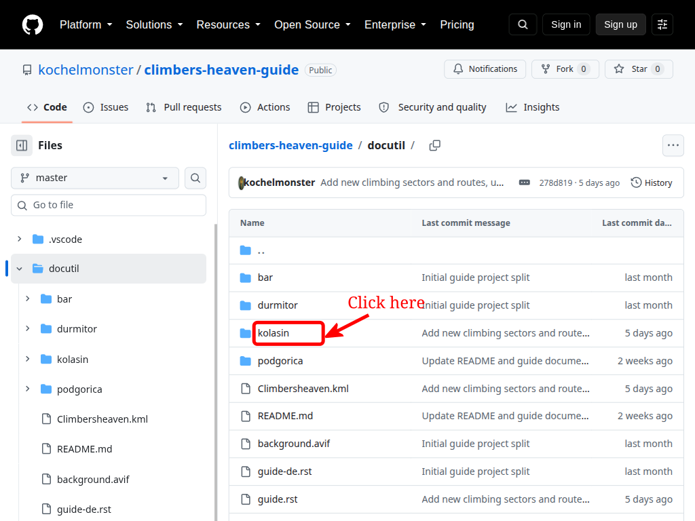
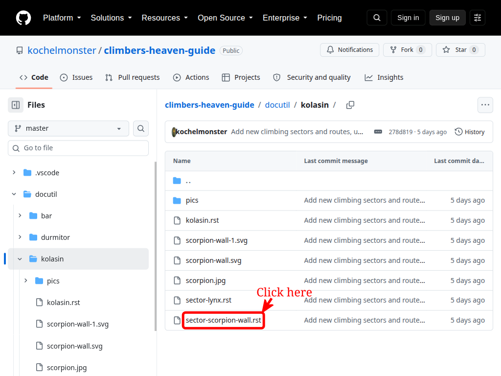
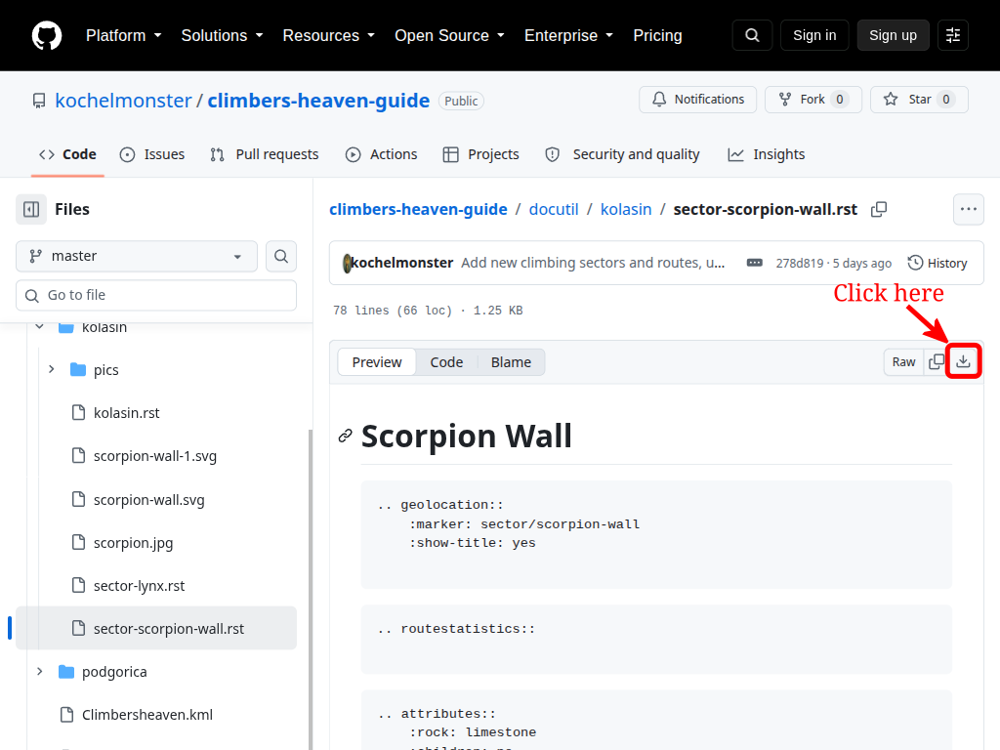
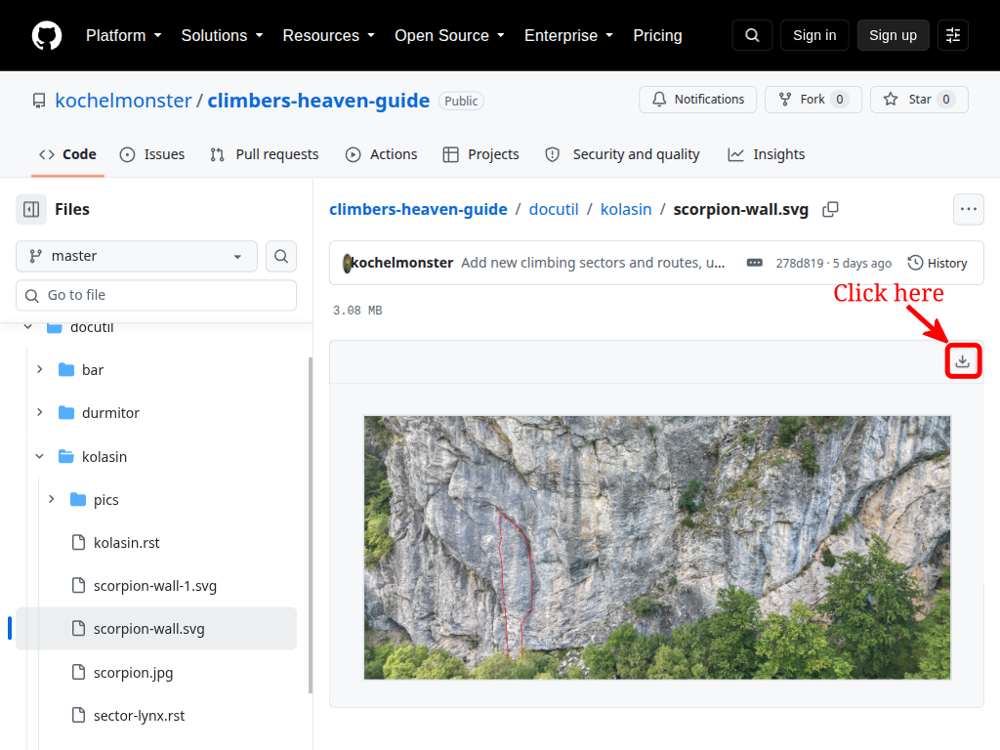
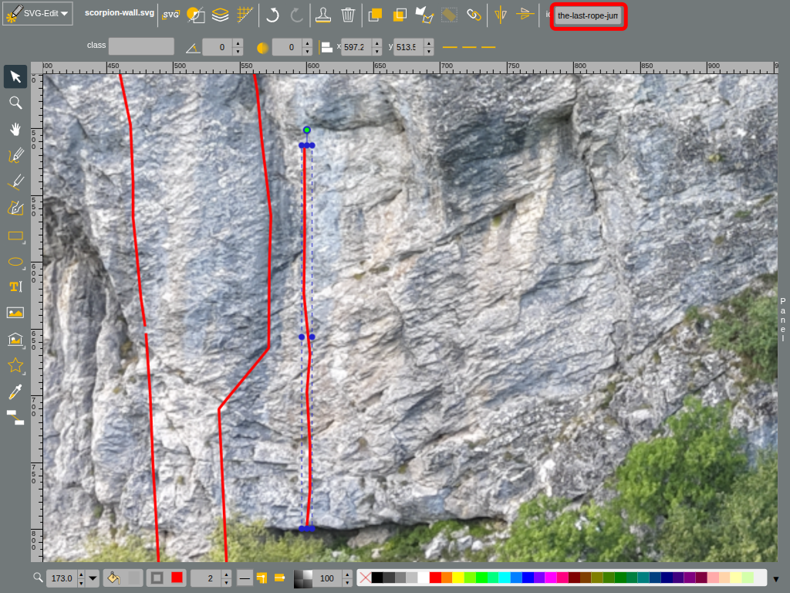

# Tutorial: Add Climbing Content

This tutorial explains how to add a new climbing route to an existing sector without writing code. It is intended for contributors who do not have a GitHub account.

The example adds a route named "The last rope jump" to the Scorpion Wall sector in Kolašin. You will edit two files: the sector description, which contains the route details, and the sector topo, which shows the route on the climbing-wall diagram.

## Step 1: Open the guide source


## Step 2: Open the Kolašin area



## Step 3: Open the sector description

Open `sector-scorpion-wall.rst`, the description file for the Scorpion Wall sector.


## Step 4: Download the description file

Download the file to your computer so that you can edit it locally.




## Step 5: Open the file in a text editor

Open the downloaded file in a plain-text editor. The file uses reStructuredText (RST), the format used for the guide's source content.
```rst
.. _Kolasin Sector Scorpion Wall:

Scorpion Wall
=============

.. geolocation::
    :marker: sector/scorpion-wall
    :show-title: yes

.. routestatistics::

.. attributes::
    :rock: limestone
    :children: no
    :approach: 15
    :altitude: 1200
    :orientation: se
    :season: May - Oct
    :8anu: https://www.8a.nu/crags/sportclimbing/montenegro/kolasin/routes

.. topo::  scorpion-wall.svg

.. route:: Što je bolan
    :grade:  6a+
    :length:  14
    :stars:  
    :created:  
    :creator:  
    :first-ascent:  
    :style:  
    :steepness: 
    :other:  

.. route:: Tunjel
    :grade:  4
    :length:  12
    :stars:  
    :created:  
    :creator:  
    :first-ascent:  
    :style:  
    :steepness: 
    :other:  

.. route:: The walk on our side
    :grade:  5b
    :length:  8
    :stars:  
    :created:  
    :creator:  
    :first-ascent:  
    :style:  
    :steepness: vertical
    :other:  

.. route:: Glavna stanica Kolašin
    :grade:  7a+
    :length:  15
    :stars:  3
    :created:  
    :creator:  
    :first-ascent:  
    :style:  
    :steepness:  vertical
    :other:

.. route:: Soo schwer
    :grade:  6c+
    :length:  25
    :stars:  3
    :created:  
    :creator:  
    :first-ascent:  
    :style:  
    :steepness:  vertical
    :other:  
```

## Step 6: Add the route description

Routes are listed from left to right, matching their positions on the topo. In this example, "The last rope jump" is to the right of "Soo schwer", so insert the new route after the "Soo schwer" block.

Replace the blank values with the information you know. Leave a field blank if you do not have the relevant information.

```rst
.. route:: The last rope jump
    :grade:  6b
    :length:  15
    :stars:  
    :created:  
    :creator:  
    :first-ascent:  
    :style:  
    :steepness:  vertical
    :other:  
```

## Step 7: Download the topo file

The `.. topo::` directive identifies the topo file used by this sector: `scorpion-wall.svg`. Download that SVG file as well.



## Step 8: Open the topo file in an SVG editor

Open the topo file in an SVG editor, such as [SVG-Edit](https://svgedit.netlify.app/index.html). In SVG-Edit, choose `SVG-Edit -> Open SVG` and select the downloaded topo file.

## Step 9: Adjust the path drawing parameters


Set the path's fill color to `none`, its stroke color to `red`, and its stroke width to `2`.

## Step 10: Draw the route line


Use the path tool to draw the line that represents the new route on the topo.

## Step 11: Set the path ID

Select the path and set its ID to the route name in lowercase, with spaces replaced by dashes. For example, the ID for "The last rope jump" is `the-last-rope-jump`.



## Step 12: Save the topo file

Choose `SVG-Edit -> Save SVG` and save the edited file on your computer. Keep the original filename, `scorpion-wall.svg`.

## Step 13: Send both files to the guide maintainer

Send the edited RST description file and SVG topo file to the guide maintainer. The maintainer will review the changes and add them to the guide.

## Helpful References

- Directive reference: `docutil/README.md`
- Smokovac route example: `docutil/podgorica/smokovac/sector-d.rst`
